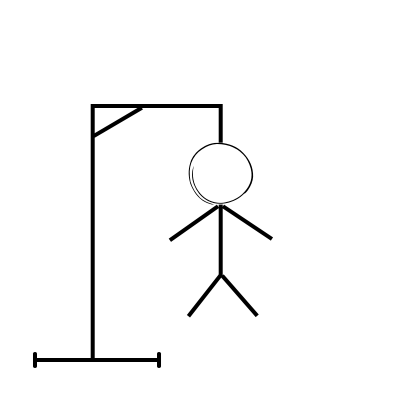

# 🕹️ Hangman Game

A classic **Hangman** word-guessing game built using **HTML**, **CSS**, and **JavaScript**. Test your vocabulary and guess the word before you run out of lives!

## 📸 Preview

[⬇️ Download ZIP](https://github.com/Somilgupta07/hangman-game/archive/refs/heads/main.zip)

## 🚀 Features

- Clean and responsive UI
- Random word selection
- Alphabet button input
- Win/loss message display
- Word bank can be easily updated

## 🛠️ Tech Stack

- HTML5
- CSS3
- JavaScript (Vanilla JS)

## 📂 Folder Structure
